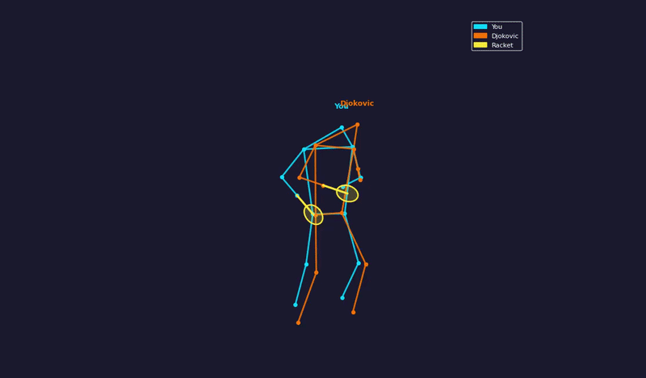
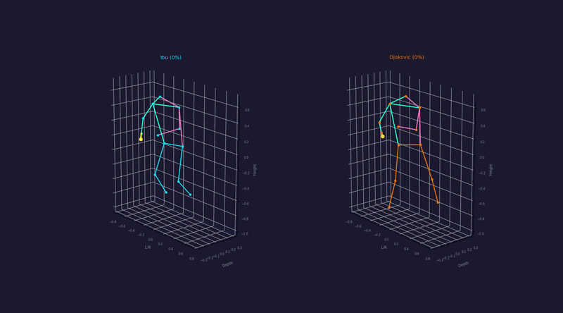
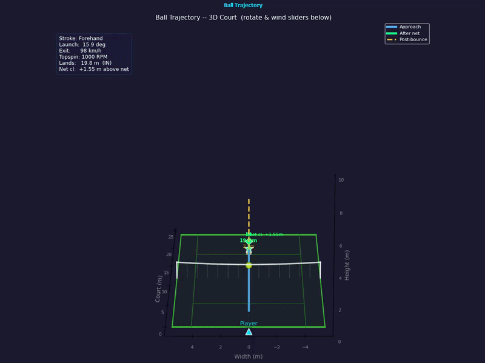

# Tennis Stroke Analyzer

The Tennis Stroke Analyzer is a computer vision application built to help players evaluate and improve their technique. By utilizing deep learning models, the software tracks human pose landmarks and tennis rackets from video recordings, extracting 3D joint angles to deliver a side-by-side comparative analysis against reference data compiled from professional players.

## Visual Demonstrations

### 1. 2D Pose and Racket Tracking View

This view displays the video analysis with the 2D skeleton overlay and real-time tennis racket tracking boundary graphics.



### 2. 3D Joint Reconstruction View

This panel maps out the normalized 3D coordinate system, isolating human joint positioning relative to professional archetypes.



### 3. Ball Trajectory and Motion Analysis

This visualization plots the exact path, velocity metrics, and launch angles calculated from the sequence data.



## Key Features

- **Biomechanical Tracking:** Leverages MediaPipe to capture precise 3D body coordinates independent of camera distance.
- **Equipment Detection:** Integrates YOLOv8 object detection to track the path, center, and angle of the tennis racket throughout the movement.
- **Automated Stroke Identification:** Supports data collection and profile generation for major strokes: Forehands, Backhands, and Serves.
- **Sequence Alignment:** Utilizes Dynamic Time Warping (DTW) to dynamically map user movements to professional templates, correcting for differences in timing and speed.
- **Graphical User Interface:** Built with PyQt5, featuring live overlay visualizers, interactive charts, and structured feedback panels.

## Project Structure

Ensure your local project directory is organized exactly as follows before executing scripts:

```text
tennis-stroke-analyzer/
│
├── data/
│   ├── professional/
│   │   ├── forehand/
│   │   ├── backhand/
│   │   └── serve/
│   ├── collect_pro_data.py
│   └── reference_builder.py
│
├── processing/
│   ├── comparator.py
│   ├── pose_extractor.py
│   └── racket_tracker.py
│
├── ui/
│   └── main_window.py
│
├── images/
│   ├── 2d_view.gif
│   ├── 3d_view.gif
│   └── trajectory_view.gif
│
├── main.py
└── README.md
```

## Installation and Setup

### Prerequisites

- Python 3.8 to 3.11 (Ensure Python is added to your system PATH)
- NVIDIA GPU with CUDA support *(Optional, heavily recommended for faster YOLOv8 inference frame rates)*

### Installation Steps

#### 1. Clone or Download the Repository

Download the project structure to your local machine and navigate into the root directory:

```bash
cd tennis-stroke-analyzer
```

#### 2. Install Core Dependencies

Install the required mathematical, computer vision, and graphical library packages via pip:

```bash
pip install numpy opencv-python PyQt5 matplotlib ultralytics dtaidistance
```

#### 3. Install Machine Learning Frameworks (Windows / CUDA Note)

**Windows Users:** The application preloads PyTorch to resolve core library conflicts (`c10.dll` errors) before initializing the user interface. Ensure PyTorch is successfully installed:

```bash
pip install torch torchvision
```

**CUDA Acceleration (Optional):** If running with an NVIDIA GPU, install the CUDA-enabled version of PyTorch from the official PyTorch website to drastically accelerate the YOLOv8 tennis racket tracking system.

## How to Use

### Running the Application

Launch the graphical user interface by executing the main file from the project root:

```bash
python main.py
```

### Compiling Professional Reference Models

The system evaluates user swings against standard metrics built from professional video tracking. To compile or force rebuild these data profiles:

#### 1. Add Professional Video Clips

Drop your raw video clips of professional players into their respective stroke folders:

```text
data/professional/forehand/
data/professional/backhand/
data/professional/serve/
```

#### 2. Execute the Data Builder

Run the data builder from the project root directory:

```bash
python data/collect_pro_data.py
```

Build a specific stroke target:

```bash
python data/collect_pro_data.py --stroke forehand
```

Overwrite existing data:

```bash
python data/collect_pro_data.py --force
```

## Technologies Used

- **GUI Framework:** PyQt5
- **Computer Vision:** MediaPipe Pose (`VisionRunningMode.IMAGE`), OpenCV
- **Object Detection:** Ultralytics YOLOv8 (`yolov8n.pt` framework)
- **Mathematical Operations:** NumPy, DTAIDistance *(Dynamic Time Warping sequence alignment)*
- **Visualization Engine:** Matplotlib *(integrated Qt5Agg backend)*